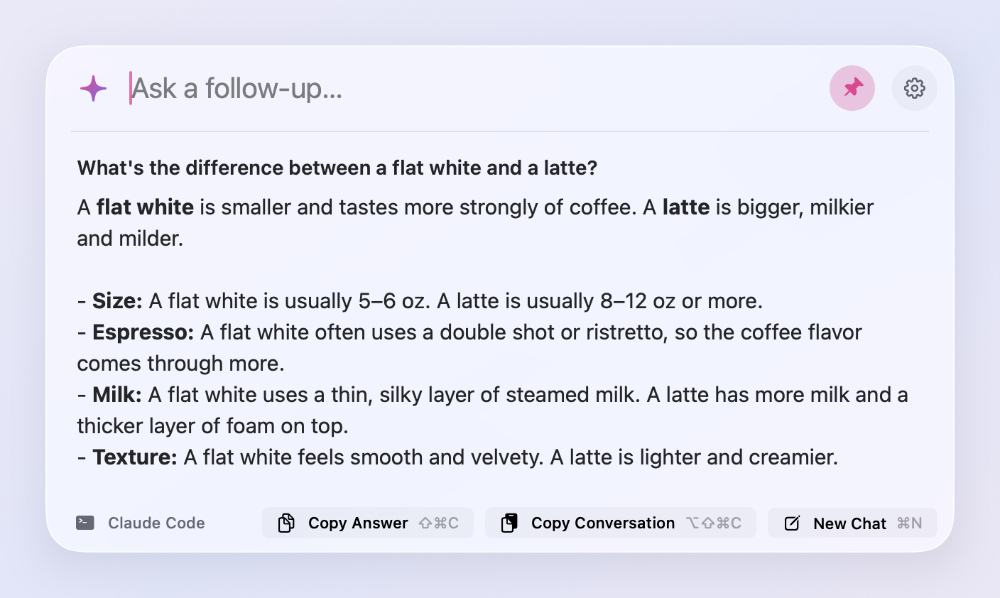
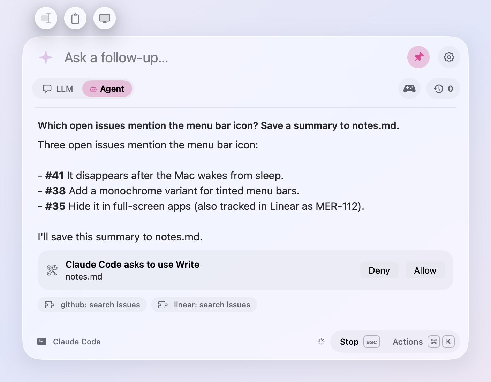
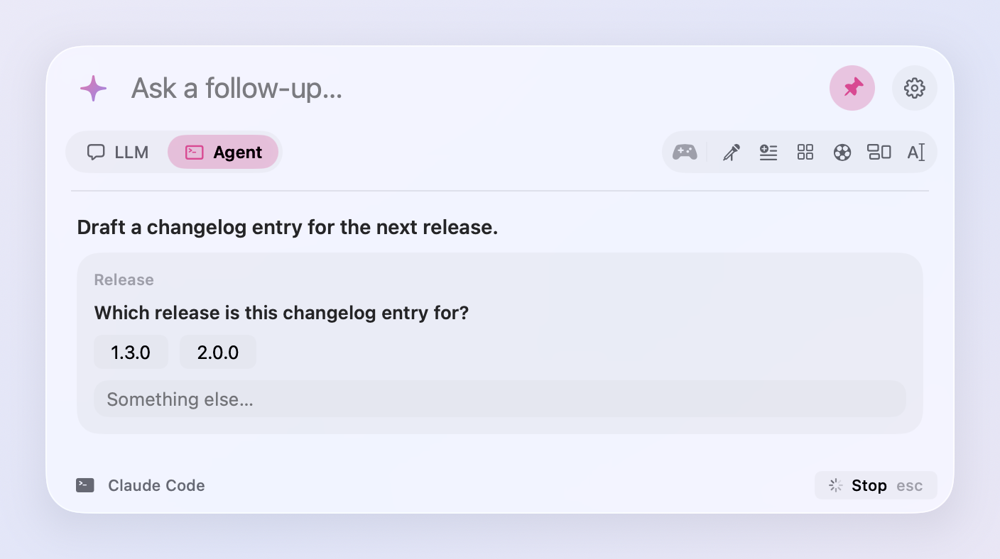
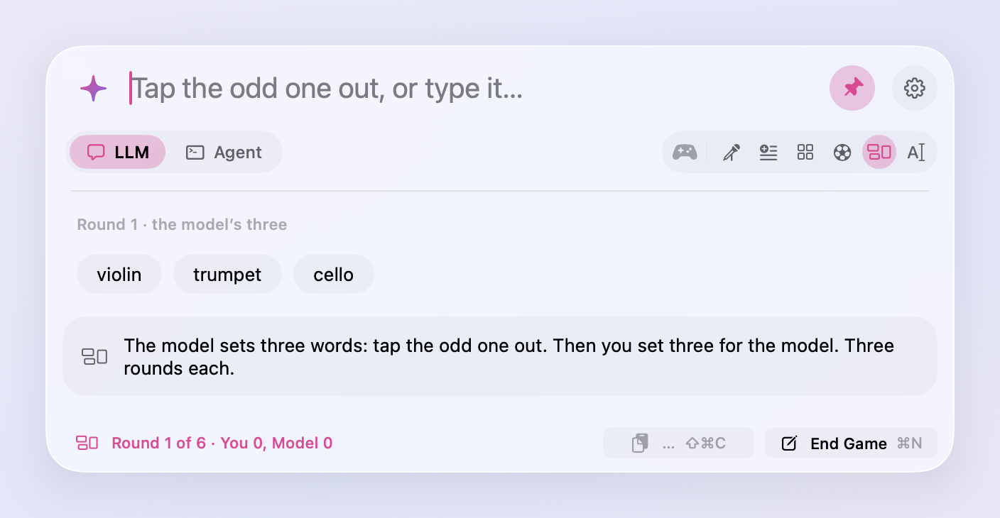
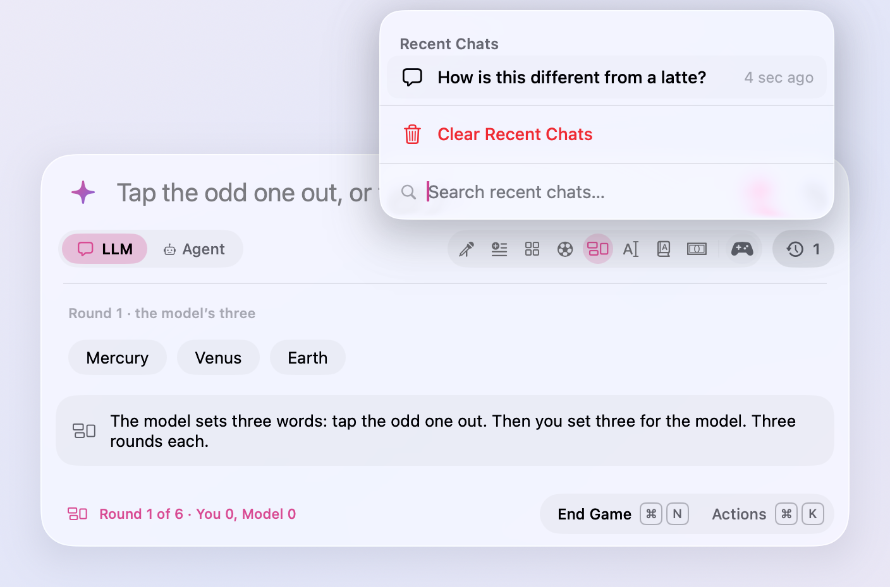
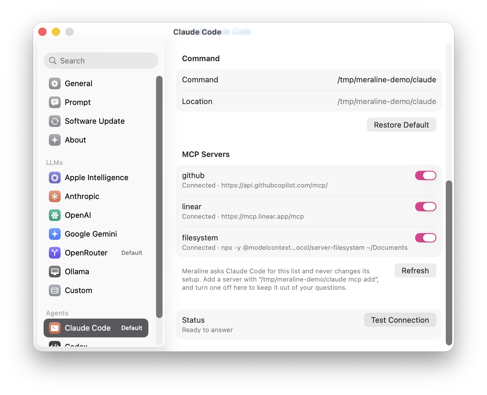

<p align="center">
  <picture>
    <source media="(prefers-color-scheme: dark)" srcset="docs/icon-dark.png">
    
  </picture>
</p>

<h1 align="center">Meraline</h1>

<p align="center">
  <strong>Ask AI anything, right where you are. Then let it go.</strong>
</p>

<p align="center">
  <a href="https://github.com/Meldiron/meraline/releases/latest/download/Meraline.dmg"></a>
  <br>
  <sub>macOS 26 or later · <a href="https://github.com/Meldiron/meraline/releases/latest">What's new</a></sub>
</p>

<p align="center">
  <a href="https://github.com/Meldiron/meraline/actions/workflows/ci.yml"></a>
  
  
</p>

---

Meraline is a tiny Mac app for quick questions. Press <kbd>⌥</kbd> <kbd>Space</kbd>, type, and the answer streams in a small glass window. Ask a follow-up if you need one. Click away and it waits for you; press <kbd>Esc</kbd> to start fresh. Leave it hidden for half an hour and the next question starts a fresh chat on its own.

There are no chat lists to manage, no saved history, and no projects. Nothing is saved to disk. Pin the window (📌 or <kbd>⌘</kbd> <kbd>P</kbd>) to keep it open while you work in other apps.

<p align="center">
  <picture>
    <source media="(prefers-color-scheme: dark)" srcset="docs/screenshots/panel.png">
    
  </picture>
</p>

## What it does

✨ **Opens anywhere.** A global shortcut brings up the window over whatever you're doing, on any Space or full-screen app. It doesn't steal focus from the app you're in.

💬 **Answers quickly.** Replies stream in as they're written, with bold, italics, code, and links rendered. While a model searches the web or runs a tool, you see what it's doing. While it thinks, Meraline murmurs ("sharpening pencils…", "asking the void…", "consulting the sparkle council…").

✂️ **Knows what you selected.** Select text in any app and press <kbd>⌥</kbd> <kbd>Space</kbd>, then click the text cursor above the window: the text comes along as context, so "summarize this" or "what does this mean?" is all you type. It never joins a question until you add it, and texts from several apps can go together. Select files or folders in Finder instead and they're attached: photos for any model, anything for an agent. It needs Accessibility access, which Meraline asks for. **Services › Ask Meraline** works without it.

🖼️ **Understands images and files.** Paste a screenshot or drop an image into the window and ask about it, or use the two buttons above the window: one adds whatever you copied, the other a screenshot of your screen without Meraline in it. Agents take PDFs, spreadsheets, and any other file too, and whole folders: drop a project and ask about it, and the agent works on a copy of it, never on your own.

🎲 **Plays word games.** The controller under the input opens eight quick games against the model: Rhyme Duel, Add-a-Word, Categories, Word Football, Odd One Out, Fix the Typo, Speed Definitions, and Letter Auction. The model moves first, a move that breaks the rules comes back to you instead of costing a turn, and <kbd>Esc</kbd> forgets the game like any other chat. When a round ends, Play Again and your tally against the model stay close at hand until you quit.

🍎 **Works out of the box.** On a Mac with Apple Intelligence, the on-device model built into macOS answers the moment you install. No key, no account, and nothing leaves your Mac.

🔌 **Uses the AI you already have.** The toggle under the input switches between asking an LLM and asking an agent (<kbd>⌘</kbd> <kbd>1</kbd> and <kbd>⌘</kbd> <kbd>2</kbd>). Click the sparkle to pick among that mode's providers you've turned on. The clock under the input keeps your last five chats, with their count on it, until you quit Meraline. To forget them sooner, clear them from the clock, or shake the window while you drag it.

| | Works with |
| --- | --- |
| **On this Mac** | Apple Intelligence, the on-device model in macOS 26 |
| **API keys** | Anthropic, OpenAI, Google Gemini, OpenRouter |
| **Local models** | Ollama, LM Studio, or any OpenAI-compatible server |
| **Command-line agents** | Claude Code, Codex, OpenCode, using the account they're signed in to and the MCP servers set up in them |

🔒 **Stays private.** API keys live in your Keychain. Conversations exist only in memory. OpenAI requests ask not to be stored, and command-line agents run in an empty temporary folder without saving a session. For a question you'd rather not see again, anonymous mode (<kbd>⇧</kbd> <kbd>⌘</kbd> <kbd>N</kbd>) turns the sparkle graphite, in sunglasses, and keeps chats out of Recent Chats. When you do want to keep something, copy the answer or the whole conversation as Markdown.

⚙️ **Feels at home on a Mac.** Settings look like System Settings, the icon follows light and dark mode, and updates install themselves.

<table align="center">
  <tr>
    <td align="center">
      <picture>
        <source media="(prefers-color-scheme: dark)" srcset="docs/screenshots/agent.png">
        
      </picture>
    </td>
    <td align="center">
      <picture>
        <source media="(prefers-color-scheme: dark)" srcset="docs/screenshots/question.png">
        
      </picture>
    </td>
  </tr>
  <tr>
    <td align="center"><sub>Agents show the MCP tools they use and ask before writing to the chat's workspace</sub></td>
    <td align="center"><sub>An agent's questions come with their choices</sub></td>
  </tr>
  <tr>
    <td align="center">
      <picture>
        <source media="(prefers-color-scheme: dark)" srcset="docs/screenshots/game.png">
        
      </picture>
    </td>
    <td align="center">
      <picture>
        <source media="(prefers-color-scheme: dark)" srcset="docs/screenshots/menu.png">
        
      </picture>
    </td>
  </tr>
  <tr>
    <td align="center"><sub>Eight word games unfold from the controller, one click each</sub></td>
    <td align="center"><sub>The clock keeps your recent chats, to reopen or clear</sub></td>
  </tr>
  <tr>
    <td align="center" colspan="2">
      <picture>
        <source media="(prefers-color-scheme: dark)" srcset="docs/screenshots/settings.png">
        
      </picture>
    </td>
  </tr>
  <tr>
    <td align="center" colspan="2"><sub>Settings look like System Settings; each agent lists its MCP servers with a switch for each</sub></td>
  </tr>
</table>

## Getting started

With [Homebrew](https://brew.sh):

```sh
brew install --cask meldiron/tap/meraline
```

Or download the latest `Meraline-<version>.dmg` from [Releases](https://github.com/Meldiron/meraline/releases/latest), open it, and drag **Meraline** into your Applications folder.

Then open Meraline. A sparkle appears in your menu bar, and the window opens so you can try it. On a Mac with Apple Intelligence turned on, you can ask a question right away. For other models, click the gear button (or press <kbd>⌘</kbd> <kbd>,</kbd>) and connect a provider: paste an API key, or turn on Ollama, Claude Code, Codex, or OpenCode.

That's it. Press <kbd>⌥</kbd> <kbd>Space</kbd> whenever you have a question.

> [!TIP]
> ChatGPT, Gemini, Copilot, and Raycast also use <kbd>⌥</kbd> <kbd>Space</kbd> by default, and macOS quietly gives the shortcut to whichever app grabbed it last. The first time Meraline opens, it checks for them and offers another shortcut, such as <kbd>⌥</kbd> <kbd>⇧</kbd> <kbd>Space</kbd>, to try before you keep it. If Meraline doesn't open later, pick another in **Settings › General**.

## Keyboard shortcuts

| Shortcut | What it does |
| --- | --- |
| <kbd>⌥</kbd> <kbd>Space</kbd> | Open or close Meraline (change it in Settings) |
| <kbd>↩</kbd> or <kbd>⇥</kbd> | Send |
| <kbd>⌫</kbd> in an empty input | Take out the selected text, then the last attachment |
| <kbd>⇧</kbd> <kbd>⌘</kbd> <kbd>E</kbd> | Add the text you had selected when you opened the window, or take it out again |
| <kbd>⇧</kbd> <kbd>⌘</kbd> <kbd>V</kbd> | Add what's on the clipboard, or take it out again |
| <kbd>⇧</kbd> <kbd>⌘</kbd> <kbd>S</kbd> | Add a screenshot of the screen, without Meraline, or take it out again |
| <kbd>Esc</kbd> | Stop the answer, then start a new chat, then close the window |
| <kbd>⌘</kbd> <kbd>P</kbd> | Pin or unpin the window |
| <kbd>⌘</kbd> <kbd>K</kbd> | Actions for the chat: search them, pick one with the arrows and <kbd>↩</kbd> (the sparkle's panel when no chat is open) |
| <kbd>⇧</kbd> <kbd>⌘</kbd> <kbd>C</kbd> | Copy the last answer |
| <kbd>⌥</kbd> <kbd>⇧</kbd> <kbd>⌘</kbd> <kbd>C</kbd> | Copy the whole conversation as Markdown |
| <kbd>⌘</kbd> <kbd>R</kbd> | Ask the last question again; in a finished game, play again |
| <kbd>⌘</kbd> <kbd>I</kbd> | Show a hint in a game |
| <kbd>⌘</kbd> <kbd>1</kbd> or <kbd>⌘</kbd> <kbd>2</kbd> | Ask an LLM or an agent |
| <kbd>⌘</kbd> <kbd>N</kbd> | Start a new chat |
| <kbd>⇧</kbd> <kbd>⌘</kbd> <kbd>⌫</kbd> | Delete the chat, after asking; it skips Recent Chats |
| <kbd>⇧</kbd> <kbd>⌘</kbd> <kbd>O</kbd> | Show an agent's files in Finder |
| <kbd>⇧</kbd> <kbd>⌘</kbd> <kbd>N</kbd> | Turn anonymous mode on or off |
| <kbd>⌘</kbd> <kbd>,</kbd> | Open Settings |

## Privacy, and how to check it

Meraline is built so you don't have to take its word for any of this.

- **No account and no server in between.** Questions go straight from your Mac to the provider you chose. Meraline has no backend, no analytics, and no crash reporting. The only other connection is a once-a-day update check against `github.com`, which you can turn off in Settings. Watch the traffic with any network monitor and you'll see nothing else.
- **Nothing on disk.** Conversations and games live in memory and are gone when you quit. The preferences file (`defaults read com.meldiron.meraline`) holds settings only: shortcut, window placement, and which providers are on.
- **Keys in the Keychain.** API keys are stored as Keychain items under the service `com.meldiron.meraline.api-keys`, where Keychain Access can show and delete them. They never appear in preferences, logs, or diagnostics.
- **Command-line agents stay in charge of their own sign-in.** Meraline runs the unmodified `claude`, `codex`, and `opencode` commands with session persistence off. It never reads or copies their tokens. The MCP servers set up in an agent are available to it here too, as the agent reports them; **Settings › Agents** lists them and lets you turn any of them off for Meraline alone, without touching the agent's own configuration. Each chat gives its agent a scratch folder in the temporary directory, holding only copies of the files and folders you attach, never your originals, and what the agent writes there. It is removed when the chat is forgotten or Meraline quits. When Claude Code wants to write there, or has a question of its own, Meraline shows it and waits for you.
- **The selection is read only when you ask.** With Accessibility access, Meraline reads the selected text of the app in front, or which files are selected in Finder, when you press the shortcut, and at no other time. The text stays in memory, out of your question, unless you click the text cursor to add it. It skips password fields and secure input. When an app doesn't share its selection directly, Meraline presses that app's Copy command (or ⌘C, in an app like Zed that describes nothing but its window) and puts back what was on your clipboard straight away. Turn it off in **Settings › General**.
- **Screenshots only when you click.** The screen button takes a single picture of the display the window is on, with Meraline's own windows left out, and attaches it to your next question. It needs Screen Recording access, which macOS asks you for, but Meraline never records: nothing is captured until you click, and the picture lives in memory with the chat. The clipboard button reads your clipboard only when you click it; while the window is open, Meraline only checks what kind of thing is on it, to show whether there's something to add. Passwords that password managers mark as concealed are never read.
- **On-device means on-device.** Apple Intelligence answers come from the model inside macOS. Nothing is sent anywhere.
- **It's all open source.** Search the code for `URLSession`, `Process`, and `Keychain` to see every place Meraline talks to anything.

## Automate it

Other apps and scripts can open Meraline through the `meraline://` URL scheme, which makes it easy to wire up in Shortcuts, Raycast, or a shell alias:

| URL | What it does |
| --- | --- |
| `meraline://ask?text=…` | Opens the window with the question filled in |
| `meraline://ask?text=…&send=1` | Fills it in and sends it |
| `meraline://ask?selection=…` | Opens the window with text to ask about, as if you had selected it; add `text=` and `send=1` to ask right away |
| `meraline://new` | Starts a new chat and opens the window |
| `meraline://settings` | Opens Settings |
| `meraline://settings?pane=claudeCode` | Opens Settings on a page: `general`, `prompt`, `updates`, `about`, or a provider such as `anthropic`, `apple`, or `codex` |

```sh
open "meraline://ask?text=$(python3 -c 'import urllib.parse,sys; print(urllib.parse.quote(sys.argv[1]))' 'Explain CRDTs in one paragraph')&send=1"
```

## Updates and beta builds

Meraline checks for updates once a day and installs them quietly in the background; the menu bar menu and Settings › Software Update show when one is ready. To try builds before they are released, switch **Settings › Software Update › Update channel** to Beta. After an update, Meraline shows what changed.

Something off? **Settings › About › Copy Diagnostics** gives you a report to paste into a [bug report](https://github.com/Meldiron/meraline/issues/new?template=bug_report.yml). It has no keys, questions, or answers in it.

## Build it yourself

You'll need Xcode 26 and [XcodeGen](https://github.com/yonaskolb/XcodeGen). No Apple Developer account is needed to build and run.

```sh
brew install xcodegen
git clone https://github.com/Meldiron/meraline.git
cd meraline
scripts/dev_run.sh     # build and launch
scripts/test.sh        # run the tests (add --e2e to also run the installed command-line agents)
```

`xcodegen generate` followed by `open Meraline.xcodeproj` gets you into Xcode. [CONTRIBUTING.md](CONTRIBUTING.md) has the rest; Meraline is [MIT licensed](LICENSE).

## For maintainers

Every push to `main` and every pull request runs the tests in GitHub Actions and builds a preview of the installer, attached to the run as an artifact.

To ship a new version, push a tag:

```sh
git tag v1.0.1
git push origin v1.0.1
```

The Release workflow runs `scripts/release.sh`: it builds the app with the tag's version, signs it with the Developer ID certificate, notarizes and staples it, wraps it in a styled disk image that is signed and notarized in its own right, signs the update for [Sparkle](https://sparkle-project.org), and publishes a GitHub release with the `.dmg`, the `.zip`, `appcast.xml`, debug symbols, and checksums. Installed copies check `https://github.com/Meldiron/meraline/releases/latest/download/appcast.xml` for updates once a day.

Release notes come from `CHANGELOG.md` when the version has an entry there, and from the commits since the previous tag otherwise.

[docs/releasing.md](docs/releasing.md) covers the pipeline step by step, the disk image design and how to edit it, running a release on your own Mac, and the secrets the workflow needs.
